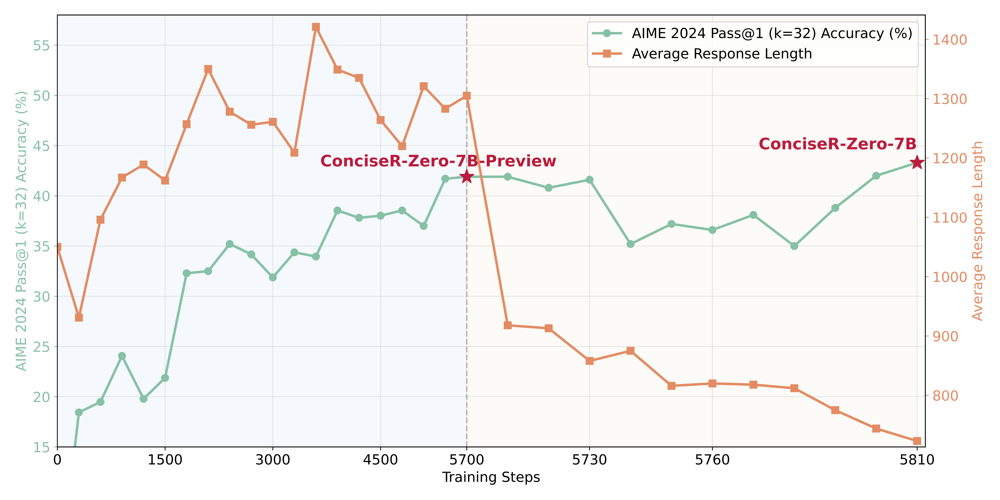

<div align='center'>
<h2>Walk Before You Run! <br/>Concise LLM Reasoning via Reinforcement Learning</h2>

<!-- TODO:  Paper, Models-->
[](https://arxiv.org/abs/2505.21178)
<a href="https://huggingface.co/collections/Nickyang/conciser-6827718942b90a6390db50c1" target="_blank"></a>
</div>

<p align='center'>

</p>

## 🎉News

- **[2025/05/27]** 🎉 We release [**ConciseR-Zero-7B**](https://huggingface.co/Nickyang/ConciseR-Zero-7B) and [**ConciseR-Zero-7B-Preview**](https://huggingface.co/Nickyang/ConciseR-Zero-7B-Preview).

## ✨Key Results

We report Pass@1 accuracy averaged over 32 samples for each problem.

| Model | AIME 2024 | MATH-500 | AMC 2023 | Minerva | Olympiad | Avg. Score |
|-------|-----------|-----------|-----------|---------|----------|------------|
| Qwen2.5-1.5B-Base | 0.0 | 3.3 | 2.5 | 1.8 | 1.5 | 1.82 |
| Qwen2.5-1.5B-Instruct | 1.3 | 57.5 | 26.2 | 19.4 | 20.3 | 24.9 |
| Qwen2.5-Math-1.5B-Base | 11.3 | 51.7 | 44.0 | 11.3 | 26.0 | 28.9 |
| Qwen2.5-Math-1.5B-Instruct | 12.0 | 74.7 | 26.7 | 35.0 | 37.9 | 37.3 |
| DeepSeek-R1-Distill-Qwen-1.5B | 28.8 | 82.8 | 62.9 | 26.5 | 43.3 | 48.9 |
| DeepScaleR-1.5B-Preview | 43.1 | 87.8 | 73.6 | 30.2 | 50.0 | 56.9 |
| FastCuRL-1.5B-Preview | 43.1 | 88.0 | 74.2 | 31.6 | 50.4 | 57.5 |
| FastCuRL-1.5B-V3 | 49.6 | 90.5 | 78.5 | 34.7 | 54.5 | 61.6 |
| | | | | | | |
| Qwen2.5-7B-Base | 3.3 | 64.6 | 30.0 | 25.7 | 29.0 | 30.5 |
| Qwen2.5-7B-Instruct | 12.3 | 77.1 | 52.8 | 34.9 | 38.7 | 43.2 |
| Qwen2.5-Math-7B-Base | 20.7 | 64.3 | 56.2 | 17.3 | 29.0 | 37.5 |
| Qwen2.5-Math-7B-Instruct | 15.7 | 82.9 | 67.0 | 35.0 | 41.3 | 48.4 |
| Eurus-2-7B-PRIME | 17.8 | 80.1 | 63.0 | 37.5 | 43.9 | 48.5 |
| Open-Reasoner-Zero-7B | 19.7 | 83.9 | 59.5 | 31.6 | 47.6 | 48.5 |
| SimpleRL-Zero-7B | 14.0 | 77.9 | 58.0 | 33.0 | 39.0 | 44.4 |
| SimpleRL-Zero-Math-7B | 22.7 | 76.9 | 62.2 | 30.1 | 39.3 | 46.2 |
| Oat-Zero-7B | 28.0 | 79.4 | 66.2 | 34.4 | 43.8 | 50.4 |
| ConciseR-Zero-7B-Preview (Stage-1) | 42.8 | 83.0 | 73.9 | 31.8 | 45.1 | 55.3 |
| ConciseR-Zero-7B (Stage-2) | 43.3 | 83.0 | 76.7 | 31.5 | 46.0 | 56.1 |

## 🎯Getting Started
### Installation


### Training Data


### Training Scripts


### Evaluate


## 🎈Citation

```bibtex
@misc{fastcurl,
      title={Walk Before You Run! Concise LLM Reasoning via Reinforcement Learning}, 
      author={Mingyang Song and Mao Zheng},
      year={2025},
      eprint={2505.21178},
      archivePrefix={arXiv},
      primaryClass={cs.CL},
      url={https://arxiv.org/abs/2505.21178}, 
}
```


## 🌻Acknowledgements

- Our model is trained on top of [`Qwen2.5-Math-7B-Base`](https://huggingface.co/Qwen/Qwen2.5-Math-7B).
- Our training experiments are powered by our heavily modified fork of [verl](https://github.com/volcengine/verl).
